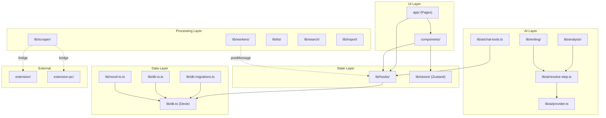

# 🗺️ Architecture Map — Novel Studio

> Quick-reference cho AI agents. Đọc file này khi cần hiểu data flow hoặc tìm code.
> Chi tiết đầy đủ: xem [`CLAUDE.md`](../../CLAUDE.md)

---

## Module Dependency Graph



---

## Data Flow

### 1. Novel CRUD
```
User Action → Component → use-novels hook → Dexie transaction → IndexedDB
                                                ↓ (useLiveQuery)
                                          UI auto-updates
```

### 2. AI Chat
```
User Message → ChatPanel → AI SDK (stream) → Provider API
                  ↓                                ↓
            Chat Tools ← Tool Call Results ← Tool Execution
                  ↓
            Dexie (read/write novel data)
```

### 3. QT Conversion
```
Source Text → Web Worker (qt-engine) → Dictionary Lookup → Converted Text
                    ↓
             Replace Worker → Regex Rules → Final Text
```

### 4. Analysis Pipeline
```
Novel → Chapter Analysis → Novel Aggregation → Character Profiling
  ↓          ↓                    ↓                    ↓
 DB    resolveStep()        resolveStep()         resolveStep()
         (model A)            (model B)             (model C)
```

### 5. Writing Pipeline
```
Context → Direction → Outline → Writer → Review → Rewrite
   ↓          ↓          ↓         ↓         ↓         ↓
 Agent      Agent      Agent     Agent     Agent     Agent
(synthetic) (interactive/auto)  (per-novel model config)
```

---

## Key File Index

| What | Where |
|------|-------|
| DB Schema & Types | `lib/db.ts` |
| DB Migrations | `lib/db-migrations.ts` (v11) |
| DB Backup/Restore | `lib/db-io.ts` |
| Novel Export/Import | `lib/novel-io.ts` |
| AI Provider Dispatch | `lib/ai/provider.ts` |
| Model Resolution | `lib/ai/resolve-step.ts` |
| Chat Tools | `lib/ai/chat-tools.ts` |
| Analysis Engine | `lib/analysis/` |
| Writing Pipeline | `lib/writing/orchestrator.ts` |
| Writing Agents | `lib/writing/agents/` |
| QT Engine Worker | `lib/workers/qt-engine.worker.ts` |
| Replace Engine Worker | `lib/workers/replace-engine.worker.ts` |
| Scraper Adapters | `lib/scraper/` |
| Extension Bridge | `lib/scraper/extension-bridge.ts` |
| TTS Providers | `lib/tts/` |
| Global Search | `lib/search/global-search.ts` |
| Book Import | `lib/import/` |
| Zustand Stores | `lib/stores/` |
| Data Hooks | `lib/hooks/use-*.ts` |
| Sidebar Config | `components/app-sidebar.tsx` |
| UI Primitives | `components/ui/` |
| Routes | `app/` |
| Fonts | Root layout (`app/layout.tsx`) |
| Tailwind Config | `app/globals.css` |

---

## Singleton Entities

| Entity | ID | Location |
|--------|----|----------|
| ChatSettings | `"default"` | `lib/db.ts` |
| TTSSettings | `"default"` | `lib/db.ts` |
| AnalysisSettings | `"default"` | `lib/db.ts` |
| ConvertSettings | `"default"` | `lib/db.ts` |
| WritingSettings | `novelId` (1 per novel) | `lib/db.ts` |

---

## Content Hierarchy

```
Novel
├── Chapter (ordered by `order` field)
│   └── Scene (ordered by `order` field)
├── Character
├── Note
├── PlotArc
│   └── PlotPoint
├── ChapterPlan
├── CharacterArc
└── WritingSettings (1:1, id === novelId)
```

---

## Routes Map

```
/                           → Landing page
/(dashboard)/
  /dashboard                → Home / stats
  /library                  → Novel library grid
  /import                   → Book import wizard
  /convert                  → Standalone QT tool
  /scraper                  → Web scraper
  /settings                 → Providers, instructions, data, changelog
  /feedback                 → User feedback form
  /novels/[id]              → Novel detail (tabs)
  /novels/[id]/chapters/[chapterId] → Chapter editor
  /novels/[id]/read/[order?]        → Reader mode + TTS
  /novels/[id]/auto-write           → Writing pipeline UI
/(auth)/
  /login                    → Auth page
/api/feedback               → Feedback submission
/api/sync                   → Data sync endpoint
```
